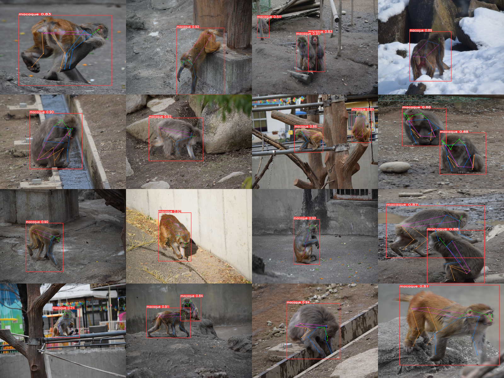

# Animal Pose Estimation with YOLOv8 Pose

## Description
This project implements an animal pose estimation model using `YOLOv8 pose` , specifically fine-tuned on a macaque dataset. </br>
The model detects and predicts keypoints for macaque poses in images, enabling applications in wildlife research and behavior analysis.
The yolo model was originally trained on human pose dataset and by leveraging a cross-species model transfer approach, the model demonstrated impressive adaptability, achieving high accuracy in predicting macaque poses. 

## Project Structure Overview
The Yolov8 pose model was finetuned on the [macaque pose dataset](https://www2.ehub.kyoto-u.ac.jp/datasets/macaquepose/).
All the code of the project can be found in the `APT.ipynb`.
Here's an overview of the code
 * **Dataset**: Download the macaque pose dataset from a specified URL and extracts the dataset from a zip file for further use.
 * **EDA (Exploratory Data Analysis)**:  - Visualize and analyze keypoints and segmentation data for macaque images.
                                         - Generating plots to assess the distribution of keypoints, identifying mislabeled keypoints, and examining image sizes.
                                         - Providing insights into the dataset's characteristics and quality.
* **YOLOv8 annotations**:  - Process segmentation data to extract bounding boxes and keypoints for macaque images.
                           - Visualizes the keypoints and bounding boxes on the images, normalizes their coordinates for YOLO format.
                           - Verify the conversion process
* **Train Model**
* **Prediction**: Make predictions on both images and videos.

## Results
| Metric     | Value   |
|------------|---------|
| Precision  | 0.9172  |
| Recall     | 0.8804  |
| mAP50      | 0.8785  |
| mAP50-95   | 0.4508  |

## Features
 * **Real-time Pose Detection**: Efficiently detects poses in real-time video feeds, making it suitable for dynamic environments.
 * **High Accuracy**: Achieves visually impressive results along with strong numerical performance, showcasing the model's effectiveness in pose estimation.
 * **Compact Architecture**: The model is designed with a small number of parameters making it ideal for deployment with minimal computational power.
 * **User-Friendly Interface**: Allows loading the model and making inferences with just a few lines of code.

## Usage
```
from ultralytics import YOLO

model = YOLO("model.pt")
results = model.predict("image.png", save=True)
```

## Visuals

